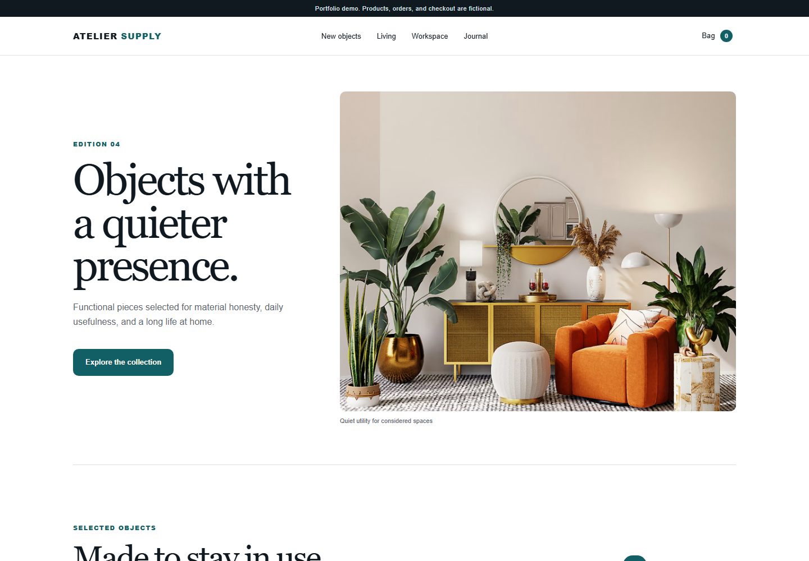

# Atelier Storefront for CS-Cart

Upgrade-safe storefront customization for **CS-Cart 4.21.1**, packaged as a standalone add-on. The project is a self-directed portfolio demo for the fictional Atelier Supply brand; it is not client work.



## Highlights

- Adds a purchase-information component through public Smarty hooks.
- Keeps PHP, templates, LESS, and JavaScript isolated from the CS-Cart core.
- Reinitializes frontend behavior after CS-Cart AJAX updates via `ce.commoninit`.
- Includes an accessible, responsive standalone preview for design review.
- Ships as an installable add-on ZIP.

## Repository layout

```text
app/addons/atelier_storefront/                         Add-on metadata and bootstrap
var/themes_repository/responsive/templates/addons/    Smarty hook templates
var/themes_repository/responsive/css/addons/          Scoped LESS styles
var/themes_repository/responsive/js/addons/           Storefront behavior
preview/                                               Standalone portfolio preview
dist/                                                  Installable add-on archive
docs/screenshots/                                      Verified demo captures
```

## Install

1. Use a licensed CS-Cart 4.21.1 installation with the Responsive theme.
2. Copy the repository files into the matching CS-Cart directories, or install the archive from `dist/atelier-storefront-addon-1.1.0.zip`.
3. In the administration panel, open **Add-ons -> Manage add-ons**.
4. Install or enable **Atelier Storefront Demo**.
5. Clear the CS-Cart cache and open a product page.

The add-on does not modify platform core files. Test it in a staging environment before production deployment.

## Standalone preview

The `preview` directory is static and has no checkout, payment, order, or customer backend.

**[Open the live interactive preview](https://vitthegrandfather.github.io/atelier-storefront-cscart/)**

```bash
cd preview
python -m http.server 4173
```

Then open `http://127.0.0.1:4173`.

Every push to `main` that changes `preview/` is deployed automatically to GitHub Pages.

## Verification

- Add-on installed and enabled in a local CS-Cart 4.21.1 environment.
- Product-page hook rendered without core template edits.
- Product option selection and add-to-cart flow smoke-tested.
- Standalone preview tested at desktop and mobile widths.
- Preview interaction test: `node --test preview/preview.test.js`.

## Scope and licensing

This repository contains only the custom add-on and original portfolio-preview assets. CS-Cart itself is proprietary software and is **not** included. Product names, storefront content, and brand details shown in the preview are fictional.

The custom code in this repository is available under the MIT License. CS-Cart trademarks and platform code belong to their respective owners.
